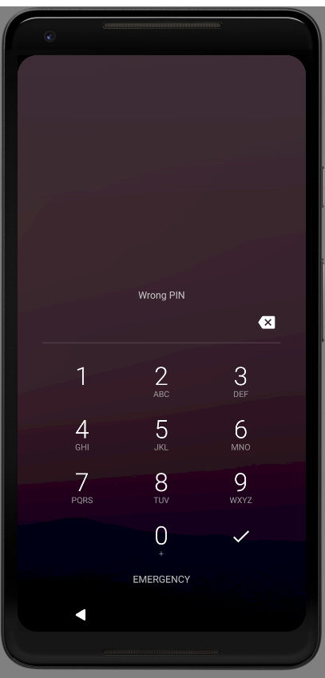
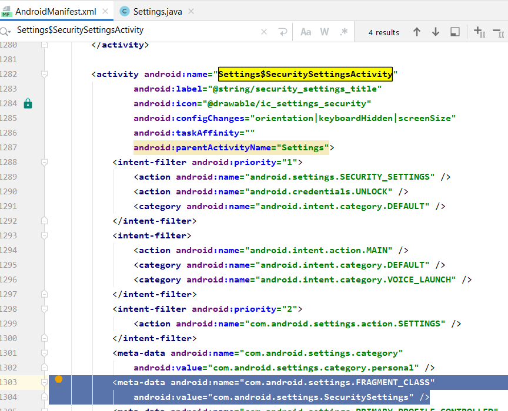
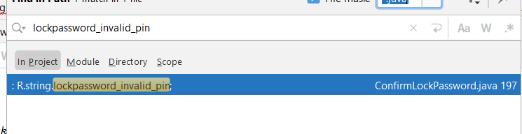
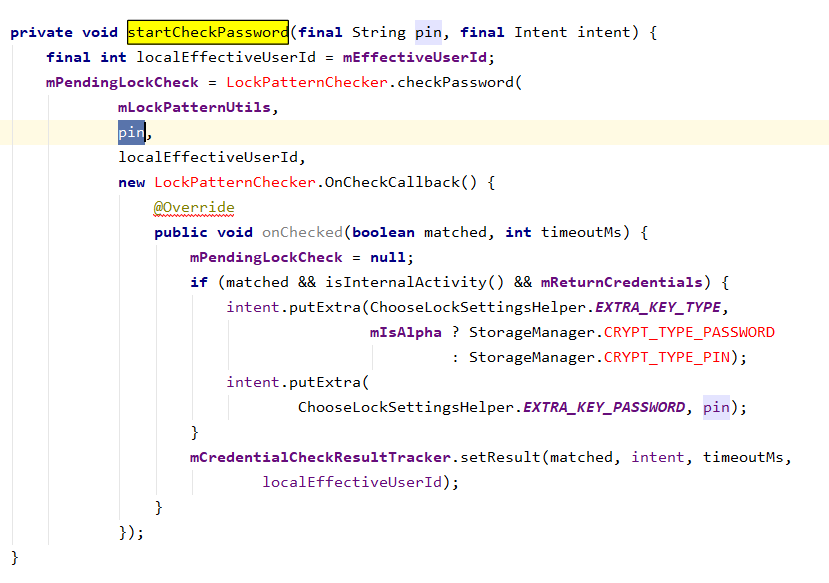
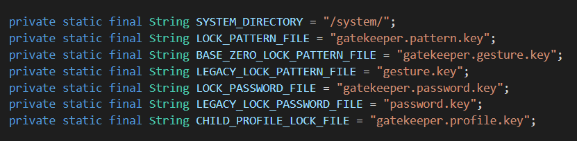
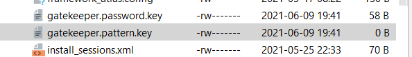

忘记了密码咋办。。。对一台开了 developer option 的设备来说，或者直接 root 过的设备来说，我们有办法开手机吗？（真人真事 = =



查看 Activity 栈：

```
> adb shell dumpsys activity activities | sed -En -e '/Running activities/,/Run #0/p'
    Running activities (most recent first):
      TaskRecord{f1366ed #28 A=com.android.settings U=0 StackId=1 sz=2}
        Run #1: ActivityRecord{9db1564 u0 com.android.settings/.Settings$SecuritySettingsActivity t28}
        Run #0: ActivityRecord{4049223 u0 com.android.settings/.Settings t28}
    Running activities (most recent first):
      TaskRecord{10af970 #27 I=com.google.android.apps.nexuslauncher/.NexusLauncherActivity U=0 StackId=0 sz=1}
        Run #0: ActivityRecord{d1e4111 u0 com.google.android.apps.nexuslauncher/.NexusLauncherActivity t27}
```

我的模拟器是 Android 7.1.1，所以得切一下分支

```bash
> git clone https://android.googlesource.com/platform/packages/apps/Settings
> cd Setting/
> git checkout remotes/origin/nougat-release
```

AndroidManifest 矛头指向：


生看一下子太难，旁门左道走一下, 从 page 上的字着手 "Wrong Pin" => lockpassword_invalid_pin



矛头指向 LockPatternChecker.



文件不在 Settings/ 中，去 aosp 搜一下，是 framework/base 的，下一下：

```bash
git clone  https://android.googlesource.com/platform/frameworks/base
mv base framework-base && cd framework-base/
git checkout remotes/origin/nougat-release
```

LockPatternChecker.java checkPassword

=> LockPatternUtils.java checkPassword

  => getLockSettings().checkPassword(password, userId);

​     => ILockSettings service = ILockSettings.Stub.asInterface(

​          ServiceManager.getService("lock_settings"));

=> LockSettingsService.java checkPassword

  => verifyCredential ( CredentialHash, String credential/*password*/ )

## LockSettingsStorage

CredentialHash LockSettingStorage::readPatternHash(userId)

比较有意思的是里面列了很多 key 文件：



仔细一看，原来是在 `/data/system/` 下面，而且时间戳很接近，估计就是我设置了之后，才生成的：



看了一眼，由于 pattern.key 是空的，readPatternHash 会返回 Null。本以为还会读取 password.key 的，实际上没有，这是怎么一回事呢？

不管了，看一下他是怎么写入 password.key 以及读取的。

写入是先调用函数 enrollCredential(enrolledHandle, enrolledCredential, password) 返回值是 byte[], 再将 byte[] 写入 password.key 文件。

太惨了，似乎 password 成了 keystore 的密码了 ？？？