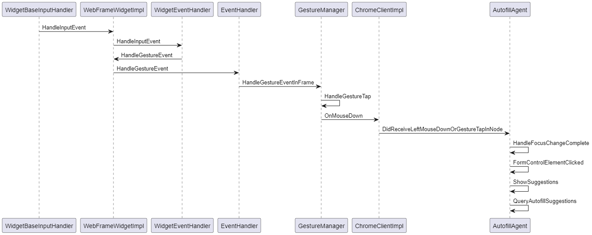

> 本文将讨论
>
> *  Autofill 触发的时机及其代码路径
> * Autofill 填充的数据存放位置
> * 如何去判断当前 autofill 要填充的是什么（以 Credit card 为例）

[TOC]

# 代码主流程

Autofill 代码流程分为俩层，Renderer 层接收 Click/Touch 事件, 通过 mojo，调用至 Browser 层，Browser 层负责获取要 Autofill 的数据，以及最终展示 autofill 框。流程图如下：

Renderer 层: ([plantuml](src/autofill-render-layer-flow.plantuml))



Browser 层: ([plantuml](src/autofill-browser-layer-flow.plantuml))


从图二可以知晓，`BrowserAutofillManager` 接收到的是 askForValuesToFill 指令，而输出的则是 Autofill 的 **suggestions**, 传递给后生，最后 show Popup.

我们非常想了解的 Autofill 数据从何而来，可以从 `BrowserAutofillManager` 怎么输出 **suggestions** 可以窥看一二。

# Data Store

在 `BrowserAutofillManager` 中，有个方法引人注目：

```c++
void BrowserAutofillManager::GetAvailableSuggestions(
    const FormData& form,
    const FormFieldData& field,
    std::vector<Suggestion>* suggestions,
    SuggestionsContext* context)
```

这个方法会获取所有的 autofill suggestions，通过 `suggestions` 指针返回。

与此同时，他还会做些检查，譬如 is_filling_credit_card, form 是否 secure, is_autofill_avaliable 等等，此类检查结果通过 `context` 指针返回。

本文将以 CreditCard 为例，描述它怎么获取 credit card 数据的。这里面其实还有 怎么判断当前是要填充 credit card 的内容，为了内容连贯性，放在后文描述。

当你浏览方法，从 `BrowserAutofillManager::GetAvailableSuggestions()` 到 `autofill::PersonalDataManager::GetCreditCards()`，这里你将看到俩种 CreditCards 信息，`local_credit_cards_` 以及 `server_credit_cards_`. 

以 `local_credit_cards_` 为例，它加载于 `PersonalDataManager::LoadCreditCards()`, 调用的是 `database_helper_->GetLocalDatabase()->GetCreditCards()` 方法。再往下看其最终的 database，你会找到一处叫 `components/webdata_services/web_data_service_wrapper.cc` 的文件，里面讲述的数据库名为 `kWebDataFilename="Web Data"`. 这里面的 table 除了 AutofillTable, 还有 KeywordsTable, PaymentMethodManifestTable 等等。

而我们想要获取的 CreditCards 信息，存在于 `AutofillTable` 中，这个调用的代码在 `AutofillWebDataBackendImpl::GetCreditCards()` 之中。

## Update database

数据库内的 creditcard 数据，除了本地手动加减之外，还会有什么逻辑修改其内容吗？

如果你去看 AutofillTable 的声明，你会发现它继承自 `syncer::SyncMetadataStore`, 从同事口中得知，这类数据是同步数据，会同步到同一账号的不同平台。一般是挂载到 MetadataChangeList 中去的，譬如：

```c++
std::unique_ptr<syncer::MetadataChangeList>
AutofillWalletSyncBridge::CreateMetadataChangeList() {
  DCHECK_CALLED_ON_VALID_SEQUENCE(sequence_checker_);
  return std::make_unique<syncer::SyncMetadataStoreChangeList>(
      GetAutofillTable(), syncer::AUTOFILL_WALLET_DATA,
      base::BindRepeating(&syncer::ModelTypeChangeProcessor::ReportError,
                          change_processor()->GetWeakPtr()));
}
```

# How to determine this textfield is for CreditCards ?

目光回到方法 `BrowserAutofillManager::GetAvailableSuggestions`

```c++
void BrowserAutofillManager::GetAvailableSuggestions(
    const FormData& form,
    const FormFieldData& field,
    std::vector<Suggestion>* suggestions,
    SuggestionsContext* context)
```

这里的 context 会计算 is_filling_credit_card, 其代码为：

```c++
    if (context->focused_field->Type().group() == FieldTypeGroup::kCreditCard) {
      context->is_filling_credit_card = true;
    }
```

textfield 怎样才能算 kCreditCard 呢？细心往上找你能找到这些：

```c++
//components/autofill/core/browser/autofill_type.cc
FieldTypeGroup GroupTypeOfHtmlFieldType(HtmlFieldType field_type,
                                        HtmlFieldMode field_mode) {
  switch (field_type) {
    ...
    case HtmlFieldType::kCreditCardNumber:
    case HtmlFieldType::kCreditCardExpMonth:
    case HtmlFieldType::kCreditCardExpYear:
      ...
      return FieldTypeGroup::kCreditCard;
  }
}

//components/autofill/core/common/autocomplete_parsing_util.cc
absl::optional<HtmlFieldType> ParseStandardizedAutocompleteAttribute(
    base::StringPiece value) {
  static constexpr auto standardized_attributes =
      base::MakeFixedFlatMap<base::StringPiece, HtmlFieldType>({
      ...
          {"cc-exp", HtmlFieldType::kCreditCardExp},
          {"cc-exp-month", HtmlFieldType::kCreditCardExpMonth},
          {"cc-exp-year", HtmlFieldType::kCreditCardExpYear},
          {"cc-number", HtmlFieldType::kCreditCardNumber},
     ...
```

而我测试的网站，填充 creditcard 的 HTML 为：

```html
<input autocomplete="cc-number"...>
```

眼尖的你会发现，`cc-number` => `kCreditCardNumber` => `kCreditCard`

这也告诉我们，如果有个该填充 creditcard 的结果没有显示 credit card 信息，我们或许可以去看看 `autocomplete` 属性是否有问题。

# 后记

我们今天讨论了 autofill 功能的大体代码流程，从页面点击到查询数据，显示数据。

我们也讨论了数据在哪存储以及浏览器是怎么判断当前要 autofill creditcard 的。可以说是干货满满（

不过涉及到哪个数据要填哪个空，这类问题我们并没有深入了解，是不是可以安排上了呢（挖坑）

在看的过程中，有个 `AutofillTable::autofill_table_encryptor_` 成功地引起我的注意。是不是了解了 encrypt 算法，就可以（为所欲为.jpg)

