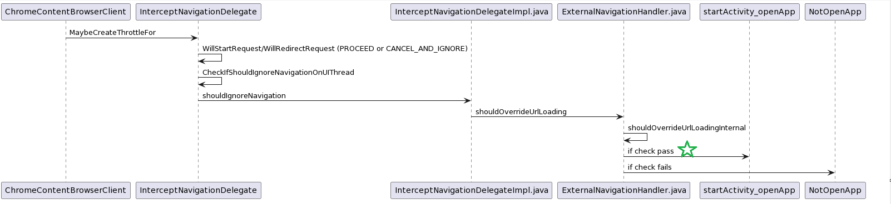

# Android DeepLink

## brief introduction

Android DeepLink means that web developer could craft a link, and when user click that link in chromium-like browser, it will redirect to the app user installed, or even open the app page in Google Play if they haven't installed it.

Take one of my favorite apps, Zhihu.

You could craft a link like this: `intent://www.zhihu.com/#Intent;scheme=https;category=android.intent.category.BROWSABLE;package=com.zhihu.android;end`

And user would open zhihu if user have installed zhihu, or would open Google Play zhihu page to install it.

It is easy to craft, you could run the code in Android studio:

```java
intent.action = Intent.ACTION_VIEW
intent.data = Uri.parse("https://www.zhihu.com/")
intent.addCategory(Intent.CATEGORY_BROWSABLE)
intent.setPackage("com.zhihu.android")
Log.d("The Url: ", intent.toUri(Intent.URI_INTENT_SCHEME))
```

Even user just click the link `https://www.zhihu.com`. It will come out an activity picker and zhihu app is one of it.

Here are two questions you probably to know:

* What the app developer need to do to let browser access you by click link
* What chromium does to support this feature

## App Developer Guide

As you can see the craft code above, you could see:

* You need to provide an **Activity** component with
  * Action: VIEW
  * Category: BROWSABLE
  * exported: true (So that the component could be found by browser app)

Like this:

```
<activity-alias android:name="com.google.android.apps.chrome.IntentDispatcher"
    android:targetActivity="org.chromium.chrome.browser.document.ChromeLauncherActivity"
    android:exported="true">
    <intent-filter>
        <action android:name="android.intent.action.VIEW" />
        <category android:name="android.intent.category.DEFAULT" />
        <category android:name="android.intent.category.BROWSABLE" />
        <data android:scheme="http" />
    </intent-filter>
</activity-alias>
```

## What Chromium does

This is a feature call  [external_intents](https://source.chromium.org/chromium/chromium/src/+/main:components/external_intents/)

When a request is about to call or redirect, chromium Android will transform the link into an Android Intent, query the system, whether there is an app who could handle it, or just handle it by browser itself.

The query uses Android PackageManager.queryIntentActivities. And the whole flow would be:


You could check [ExternalNavigationHandler.java::shouldOverrideUrlLoading](https://source.chromium.org/chromium/chromium/src/+/main:components/external_intents/android/java/src/org/chromium/components/external_intents/ExternalNavigationHandler.java;drc=0c1cd8c71292d0093b983e30dc37a4ca81995aad;bpv=1;bpt=1;l=436?gsn=shouldOverrideUrlLoading&gs=kythe%3A%2F%2Fchromium.googlesource.com%2Fchromium%2Fsrc%3Flang%3Djava%3Fpath%3Dorg.chromium.components.external_intents.ExternalNavigationHandler%234818bee24fe148fccbc593fda9236e8a11107a923e87b255d086e8cf846097ad) for more information.


You may wonder whether we could do something funny:

* could we craft links to access any the exported Activity components?

Well, I was excited about it. That means no longer the guys have to persuade the victim to install an app, just craft a link, victim clicks it, it is done. However, the answer is no, only support few of them. (Oh, bounties)

First, it is possible for people to craft any Intent to access any exported Activity components. You could follow my first code patch.

However, these intent will be sanitized before they're used. The filter will be limited to components with  `CATEGORY_BROWSABLE`, which is quite rare in apps.

```java
// ExternalNavigationHandler.java    
public static void sanitizeQueryIntentActivitiesIntent(Intent intent) {
    intent.setFlags(intent.getFlags() & ALLOWED_INTENT_FLAGS);
    intent.addCategory(Intent.CATEGORY_BROWSABLE);
    intent.setComponent(null);
    // Intent Selectors allow intents to bypass the intent filter and potentially send apps URIs
    // they were not expecting to handle. https://crbug.com/1254422
    intent.setSelector(null);
}
```

