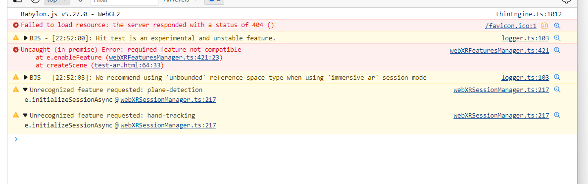
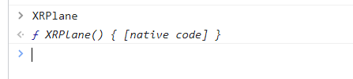

# Required feature not compatible

> 事情不总是很顺利的，不是吗？

最近在学习 BabylonJS，想要试试 BabylonJS 中的 AR 模块。仿照写了这样的句子：

```
var xr = await scene.createDefaultXRExperienceAsync({
    uiOptions: {
        sessionMode: "immersive-ar",
        requiredFeatures: ['anchors', 'hit-test', 'plane-detection'],
        referenceSpaceType: "local-floor"
    },
    optionalFeatures: true
});

const fm = xr.baseExperience.featuresManager;

const xrTest = fm.enableFeature(BABYLON.WebXRHitTest.Name, "latest");
const xrPlanes = fm.enableFeature(BABYLON.WebXRPlaneDetector.Name, "latest");   //  <====== something wrong happens here.
const anchors = fm.enableFeature(BABYLON.WebXRAnchorSystem.Name, 'latest');
```

然后得到了这样的 error：



```
Uncaught (in promise) Error: required feature not compatible
    at WebXRFeaturesManager.enableFeature (babylon.max.js:247203:23)
    at createScene (test-ar.html:65:33)
```

头大。

debug 过程中，发现之前用的 babylonjs 是混淆过的，所以改引用 https://cdn.babylonjs.com/babylon.max.js

继续调试，很快找到判断 compatible 的方式是：

```
// WebXRPlaneDetector.ts
public isCompatible(): boolean {
  return typeof XRPlane !== "undefined";
}
```

所以就成了，谁来定义 `XRPlane`, 谁忘记定义了。

## Who declare XRPlane

通过 cs.chromium.org 搜索，很容易找到文件：third_party/blink/renderer/modules/xr/xr_plane.h，并在 third_party/blink/renderer/modules/xr/xr_plane.idl 找到其 XRPlane 的配置：

```
[
    SecureContext,
    Exposed=Window,
    RuntimeEnabled=WebXRPlaneDetection
]
interface XRPlane {
    readonly attribute XRSpace planeSpace;

    readonly attribute FrozenArray<DOMPointReadOnly> polygon;
    readonly attribute XRPlaneOrientation? orientation;
    readonly attribute DOMHighResTimeStamp lastChangedTime;
};
```

比较瞩目的是 `RuntimeEnabled=WebXRPlaneDetection`

WebXRPlaneDetection, 是什么东东呢？他是 RuntimeEnabledFeature.

## RuntimeEnabledFeature

> 详见：https://source.chromium.org/chromium/chromium/src/+/main:third_party/blink/renderer/platform/RuntimeEnabledFeatures.md

RuntimeEnabledFeature 是 blink 开发者针对 blink feature 设置的 “feature flag”。

与其说 feature flag，可能 feature status 比较贴切，所有的 feature 的可选 status 为：`<缺省>` `test`  `experimental` `stable`

怎么 enable 呢？

| test         | 运行 chrome 的时候，加入 flag `--enable-blink-test-features` |
| ------------ | ------------------------------------------------------------ |
| experimental | 运行 chrome 的时候，加入 flag --enable-experimental-web-platform-features;<br />抑或是直接访问 chrome://flags, 打开  "Enable experimental web platform features" |

那我们关注的 WebXRPlaneDetection 的配置是怎么样的呢？他是 experimental 级别的。

```
//third_party/blink/renderer/platform/runtime_enabled_features.json5
{
  name: "WebXRPlaneDetection",
  origin_trial_feature_name: "WebXRPlaneDetection",
  depends_on: ["WebXRARModule"],
  public: true,
  status: "experimental",
},
```

试着把 experimental 的 feature 打开，这个时候，程序不再报错了，试着访问 XRPlane, 成功了 :D



## Takeaway

WebXR 还属于初步阶段，很多功能还在试验，这也是为什么我们使用 BabylonJS 这类应该成熟的引擎的 code 的时候，会遇到奇奇怪怪的问题。

有可能是来自 BabylonJS，也有可能是来自 Chrome.

遇到这样的问题，我们只能戒骄戒躁，稳步前行，一个问题一个问题地解决。

> Tough path isn't it? Just walk on it and never quit.