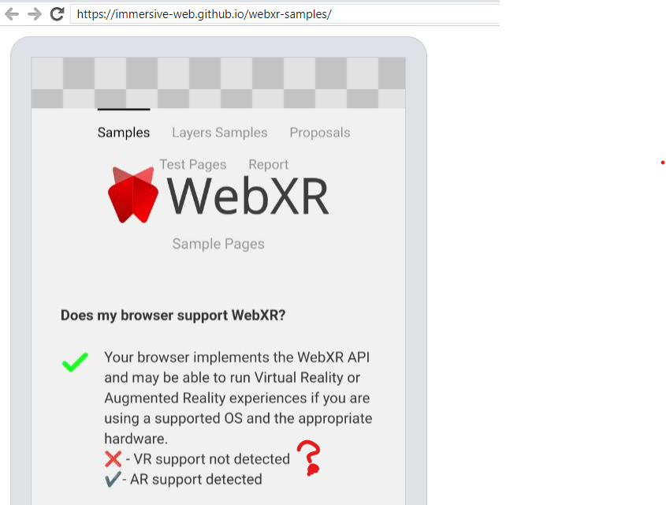
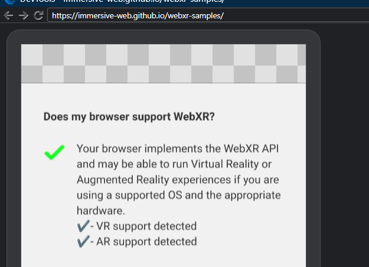

[TOC]

# 没有检测到 VR 支持

We try xr support in immersive-web and it doesn't look good.



我们想借修复 VR support not detected 的问题，了解 WebXR 的基本机制，包括 VR/AR support 大致的 code 在哪，怎么渲染的，以及最重要的，我们怎么利用这一项技术。

## immersive-web

immersive-web 是 WebXR 的测试网站，里面有各种示例，帮助我们理解我们可以在 Chromium 内利用 WebXR 做什么。

其代码开源在：`https://github.com/immersive-web/webxr-samples.git`

可以很容易找到，判断 VR/AR support 与否的代码：

```
navigator.xr.isSessionSupported('immersive-vr').then((supported) => {
  span.innerText = supported ? '✔️- VR support detected' : '❌ - VR support not detected';
  ...
});
navigator.xr.isSessionSupported('immersive-ar').then((supported) => {
  span.innerText = supported ? '✔️- AR support detected' : '❌ - AR support not detected';
  ...
});
```

所以 我们得看看 `immersive-vr` `immersive-ar` 到底对于 chromium ，意味着什么，代码在哪，有无猫腻。

## immersive-vr  immersive-ar

> 一入 chromium 深似海，原来 mojo 能力那么大

搜索 immersive-vr, 很容易找到这么一个文件：

`content/browser/xr/service/xr_runtime_manager_impl.h`

```
class CONTENT_EXPORT XRRuntimeManagerImpl {
  // Gets the system default immersive-vr runtime if available.
  BrowserXRRuntimeImpl* GetImmersiveVrRuntime();
};

BrowserXRRuntimeImpl* XRRuntimeManagerImpl::GetRuntimeForOptions(
    device::mojom::XRSessionOptions* options) {
  BrowserXRRuntimeImpl* runtime = nullptr;
  switch (options->mode) {
    case device::mojom::XRSessionMode::kImmersiveVr:
      runtime = GetImmersiveVrRuntime();
      break;
    ...
  }
}

BrowserXRRuntimeImpl* XRRuntimeManagerImpl::GetImmersiveVrRuntime() {
#if BUILDFLAG(IS_ANDROID)
  auto* gvr = GetRuntime(device::mojom::XRDeviceId::GVR_DEVICE_ID);
  if (gvr)
    return gvr;
#endif

#if BUILDFLAG(ENABLE_OPENXR)
  auto* openxr = GetRuntime(device::mojom::XRDeviceId::OPENXR_DEVICE_ID);
  if (openxr)
    return openxr;
#endif

  return nullptr;
}

void XRRuntimeManagerImpl::SupportsSession(
    device::mojom::XRSessionOptionsPtr options,
    device::mojom::VRService::SupportsSessionCallback callback) {
  auto* runtime = GetRuntimeForOptions(options.get());

  if (!runtime) {
    TRACE_EVENT("xr",
                "XRRuntimeManagerImpl::SupportsSession: runtime not found",
                perfetto::Flow::Global(options->trace_id));

    std::move(callback).Run(false);
    return;
  }

  // TODO(http://crbug.com/842025): Pass supports session on to the runtimes.
  std::move(callback).Run(true);
}
```

其中 JavaScript 中的 isSessionSupported 对应的是上文的 SupportsSession。

可以很容易知道 SupportsSession 很依赖 runtime, 而 runtime 依赖 GVR 或者 OPENXR，我们看一下这 GVR, OPENXR 是啥

## GetRuntime

可以容易找到 GVR 的条件是使用 app bundle 的方式打包：

```
// device/vr/android/gvr/gvr_device_provider.cc
void GvrDeviceProvider::Initialize(VRDeviceProviderClient* client) {
  // We only expose GvrDevice if
  //  - we could potentially install VRServices to support presentation, and
  //  - this build is a bundle and, thus, supports installing the VR module.
  if (base::android::BundleUtils::IsBundle()) {
    vr_device_ = base::WrapUnique(new GvrDevice());
  }
  if (vr_device_) {
    client->AddRuntime(vr_device_->GetId(), vr_device_->GetDeviceData(),
                       vr_device_->BindXRRuntime());
  }
  initialized_ = true;
  client->OnProviderInitialized();
}
```

而 ARCore 的条件是 Android 7.0 以上：

```
// components/webxr/android/arcore_device_provider.cc
void ArCoreDeviceProvider::Initialize(device::VRDeviceProviderClient* client) {
  if (device::IsArCoreSupported()) {
    DVLOG(2) << __func__ << ": ARCore is supported, creating device";

    arcore_device_ = std::make_unique<device::ArCoreDevice>(
        std::make_unique<device::ArCoreImplFactory>(),
        std::make_unique<device::ArImageTransportFactory>(),
        std::make_unique<webxr::MailboxToSurfaceBridgeFactoryImpl>(),
        std::make_unique<webxr::ArCoreJavaUtils>(compositor_delegate_provider_),
        client->GetXrFrameSinkClientFactory());

    client->AddRuntime(arcore_device_->GetId(), arcore_device_->GetDeviceData(),
                       arcore_device_->BindXRRuntime());
  }
  initialized_ = true;
  client->OnProviderInitialized();
}

// device/vr/android/arcore/arcore_shim.cc
bool IsArCoreSupported() {
  return base::android::BuildInfo::GetInstance()->sdk_int() >=
         base::android::SDK_VERSION_NOUGAT;
}
```


我的测试机已经是 8.0, 所以我们需要改为 bundle 的方式 build 就好了


## Bundle build apk

```bash
gn gen out/release-arm/ && autoninja -C out/release-arm/ chrome_modern_public_bundle 
out/release-arm/bin/chrome_modern_public_bundle install
```

嗯嗯，果然这样就好了：



以上。
