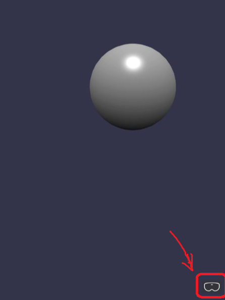
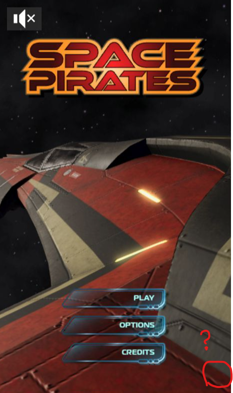

# XR button not shown

正常情况下，右下角是应该有 XR 按钮，方便你进入 webXR 的模式欣赏网页内容的。



我最近在尝试让一款 [space 网页游戏](https://github.com/BabylonJS/SpacePirates)支持 XR 模式下玩耍。正常我加了如下代码，右下角的 XR 按钮应该会出现：

```javascript
const xrHelper = await scene.createDefaultXRExperienceAsync();
```

但是他没有。



本文则是在修复这个问题之余，了解 XR 启动的逻辑。

## What is XR button

通过 inspect 容易知道，这个 button 的 HTML 代码：

```html
<div class="xr-button-overlay" style="z-index: 11; position: absolute; right: 20px; bottom: 50px;">
    <button class="babylonVRicon" title="immersive-ar - local-floor"></button>
</div>
```

很容易知道这个 button 是 BabylonJS 引入的：

https://github.com/BabylonJS/Babylon.js/blob/4ccc01e98a5f05bdcbab76699a69a93eed26461b/packages/dev/core/src/XR/webXREnterExitUI.ts#L114

```
export class WebXREnterExitUI implements IDisposable {
    public constructor(
        private _scene: Scene,
        public options: WebXREnterExitUIOptions
    ) {
        this.overlay = document.createElement("div");
        this.overlay.classList.add("xr-button-overlay");
   }
}
```

想要 debug `scene.createDefaultXRExperienceAsync();` 的调用，发现 webpack 打包的 bundle.js 是长这样：

```
/***/ "./node_modules/app_package/lib/Playground/States/State.js":
...
"use strict";
eval("\nObject.defineProperty(exports, \"__esModule\", ({ value: true }));\nexports....");
```

根本没法 debug，所以我们的小目标是去掉 webpack 打包时用的 eval 函数。

简单，只需在webpack.config.js 中添加：

```python
module.exports = {
  ...
  devtool: "inline-source-map",
}
```

解开了得知，原来我们添加的语句 compile 之后，不在最终的 bundle.js 中。汗


