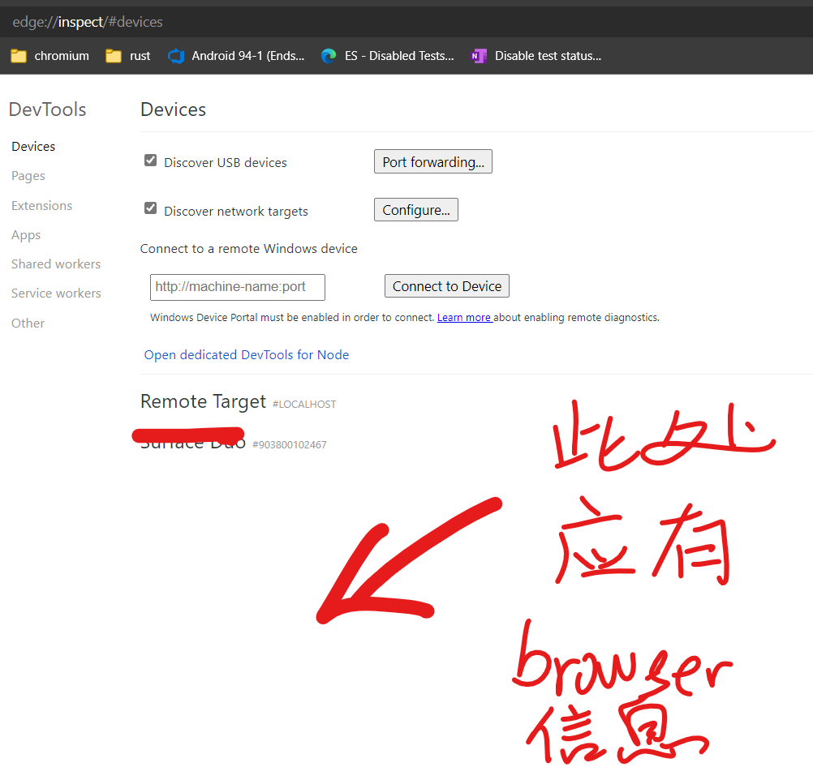

# chrome://inspect 内找不到 app 的 webview (1)

如题，没法 debug android app 内的 webview.

咋办呢？网上没搜到直接结果，只能硬上了。

## InspectUI

首先这个页面是 chromium 的 native page. 稍微搜索一下 inspect 出现的地方就能找到 chrome://inspect 对应的 native page UI：

[chrome/browser/ui/webui/inspect_ui.cc](https://source.chromium.org/chromium/chromium/src/+/main:chrome/browser/ui/webui/inspect_ui.cc)

> Chromium 的 native page 经常是一个 hostName 对应一个 XxxUI，如下图：
>
> 
>
> 而这 XxxUI 最终都是通过 xxx.html 绘制页面，比如本例中的 [inspect.html - Chromium Code Search](https://source.chromium.org/chromium/chromium/src/+/main:chrome/browser/resources/inspect/inspect.html?q=inspect.html&ss=chromium%2Fchromium%2Fsrc)

既然这个页面是 inspect.html 绘制的, 自然是可以知道负责显示 device 信息的代码：[inspect.js - Chromium Code Search](https://source.chromium.org/chromium/chromium/src/+/main:chrome/browser/resources/inspect/inspect.js). 这里吹一波 Chromium Code Search, 真的太好用了 ！

拿 Edge Canary 来试 inspect 一下，

在 chrome://inspect 中 F12，在 inspect.js 的一些地方打断点，信息量还挺多的：

可以看到它收到俩个 device，分别对应图一的俩个设备，而观察到目标设备的 browsers 数目只有 1. 也就是说我们自己 app 的 webview 并未录入其中。

继续观察 pages 数目为 3，对应 chrome://inspect 页面内可以 inspect 的页面数目。

是否只要 browsers 能录入我们自己的 webview，这个问题就能迎刃而解呢？

查看一下当前的 js 调用栈，倒霉，源头在这就断了：

这个 device 结构是谁来拼的呢？他们怎么知道目标 device 上有 browser Edge canary，这个 browser 上面还运行了这么多个 pages。

我们换种思路，直接看 device 结构怎么拼成的。

## adbBrowserName

我们选取 browser 结构内的 adbBrowserName, 去 cs.chromium.org 上面搜一下，看有没有什么收获。。。

这就是拼接现场拉？再往上看看：

获取 deviceInfo 的时候，需要跑 adb 命令

而辣个命令就是这个：

解析命令结果的地方：

经查勘，原来他们会跑一个 adb 命令 `adb shell cat /proc/net/unix`，从结果中，找一些 PATH 为 `@(.*_devtools_remote(_(.*))*)` 的行，截取其内容作为 socket _name 及其 Pid 

socket_name = regex.group(1);

pid = regex.group(3);

例如这个：

当然还有补充条件，不过由于当前的 pid 为空，所以补充条件可以忽略。

也就是说，如果我的 app 的 webview 也能开一个  `***devtools_remote`, chrome://inspect 就能发现并 debug webview.

我们先继续看看 chrome://inspect 是怎么获取 pages 信息的。

原来是用上面获取到的 socket_name 建立一个 socket 并 send request 的：

开一下 wireshark 来看看刷新 chrome://inspect 后的网络请求

发送 adb 命令的痕迹

Get /json 的 Response：

所以 pages 信息是从 socket 通信中得知的。

回过来看为何我们 app 的 WebView 不注册套接字 `**_devtools_remote`.（如果注册的话，我们就能正常 debug 了)

这该如何下手呢？

