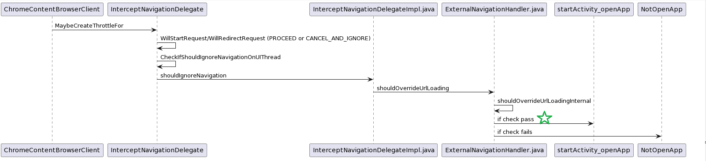

# Android DeepLink 的实现

> 你有想过在浏览器中，点击某个链接，就能跳转到 app 中，这个 chromium 到底是怎么实现的吗？
>
> 作为 app 开发者，我们怎么利用这个逻辑呢？

## External Intents

这个逻辑，叫 [external_intents](https://source.chromium.org/chromium/chromium/src/+/main:components/external_intents/)

可以从他的简介中可以看到：

* 支持通过点击 https://www.youtube.com 启动 Youtube app
* 支持判断有 Youtube app 则打开 Youtube，没有 app 则 fallback 到另外一个网址 比如这里的example.com
  * [intent://www.youtube.com#Intent;scheme=https;action=android.intent.action.VIEW;S.browser_fallback_url=https%3A%2F%2Fwww.example.com/;end](http://www.youtube.com/#Intent;scheme=https;action=android.intent.action.VIEW;S.browser_fallback_url=https%3A%2F%2Fwww.example.com/;end)

## 实现细节



简单地来说：

* 注册 NavigationThrottle, 监听 request start 或者 redirect 事件
* 事件发生时，做检查判断此时是否用 app 打开，如果是则 CANCEL_AND_IGNORE request, 表现为浏览器“没有访问网址”，而 app 被打开。否则则 PROCEED request, 也就是浏览器“正常访问网站”
* 关键点就在检查的逻辑。其位于 [ExternalNavigationHandler.java::shouldOverrideUrlLoading](https://source.chromium.org/chromium/chromium/src/+/main:components/external_intents/android/java/src/org/chromium/components/external_intents/ExternalNavigationHandler.java;drc=0c1cd8c71292d0093b983e30dc37a4ca81995aad;bpv=1;bpt=1;l=436?gsn=shouldOverrideUrlLoading&gs=kythe%3A%2F%2Fchromium.googlesource.com%2Fchromium%2Fsrc%3Flang%3Djava%3Fpath%3Dorg.chromium.components.external_intents.ExternalNavigationHandler%234818bee24fe148fccbc593fda9236e8a11107a923e87b255d086e8cf846097ad)
  * 可以看到 browserFallbackUrl 的逻辑在那
  * 判断哪些链接是可以用 app 打开，哪些继续在浏览器访问，这个逻辑在：[ExternalNavigationHandler.java::shouldOverrideUrlLoadingInternal](https://source.chromium.org/chromium/chromium/src/+/main:components/external_intents/android/java/src/org/chromium/components/external_intents/ExternalNavigationHandler.java;drc=0c1cd8c71292d0093b983e30dc37a4ca81995aad;bpv=1;bpt=1;l=1471?gsn=shouldOverrideUrlLoadingInternal&gs=kythe%3A%2F%2Fchromium.googlesource.com%2Fchromium%2Fsrc%3Flang%3Djava%3Fpath%3Dorg.chromium.components.external_intents.ExternalNavigationHandler%239e88c9cfaacd58f8fdda61de11c580a861bde806c6ea51add9ce110346f0dc65)

这个判断逻辑比较有意思且多，我们先挑几个例子，看看什么 cases 下，deeplink 是不 work 的：

* request 来自于 sub frame, 且没有 user guesture （[ExternalNavigationHandler::shouldBlockSubframeAppLaunches](https://source.chromium.org/chromium/chromium/src/+/main:components/external_intents/android/java/src/org/chromium/components/external_intents/ExternalNavigationHandler.java;drc=0c1cd8c71292d0093b983e30dc37a4ca81995aad;bpv=1;bpt=1;l=645?gsn=shouldBlockSubframeAppLaunches&gs=kythe%3A%2F%2Fchromium.googlesource.com%2Fchromium%2Fsrc%3Flang%3Djava%3Fpath%3Dorg.chromium.components.external_intents.ExternalNavigationHandler%2376ebba5035d989596078f12a2d7a0cf6bc356aa19584f2f7b3456346a89386f2)）
* 发送 request 时，browser 处于 background 状态，或者发送 request 的 tab 处于后台状态（[ExternalNavigationHandler::blockExternalNavWhileBackgrounded](https://source.chromium.org/chromium/chromium/src/+/main:components/external_intents/android/java/src/org/chromium/components/external_intents/ExternalNavigationHandler.java;drc=0c1cd8c71292d0093b983e30dc37a4ca81995aad;bpv=1;bpt=1;l=656?gsn=blockExternalNavWhileBackgrounded&gs=kythe%3A%2F%2Fchromium.googlesource.com%2Fchromium%2Fsrc%3Flang%3Djava%3Fpath%3Dorg.chromium.components.external_intents.ExternalNavigationHandler%232cc19c3e1a2a5bbfbaa3c7eea3db21a382112b1aa30772c9e3cc1e19bf8ba644), [ExternalNavigationHandler::blockExternalNavFromBackgroundTab](https://source.chromium.org/chromium/chromium/src/+/main:components/external_intents/android/java/src/org/chromium/components/external_intents/ExternalNavigationHandler.java;drc=0c1cd8c71292d0093b983e30dc37a4ca81995aad;bpv=1;bpt=1;l=670?gsn=blockExternalNavFromBackgroundTab&gs=kythe%3A%2F%2Fchromium.googlesource.com%2Fchromium%2Fsrc%3Flang%3Djava%3Fpath%3Dorg.chromium.components.external_intents.ExternalNavigationHandler%23b334043205ce37d962099db8341ebd80603835a55a4e1c73b4937d96bcabcc78)）
* 亦或者在当前 tab 处于回退到上一个页面的状态下，发送的 request [ExternalNavigationHandler::ignoreBackForwardNav](https://source.chromium.org/chromium/chromium/src/+/main:components/external_intents/android/java/src/org/chromium/components/external_intents/ExternalNavigationHandler.java;drc=0c1cd8c71292d0093b983e30dc37a4ca81995aad;bpv=1;bpt=1;l=688?gsn=ignoreBackForwardNav&gs=kythe%3A%2F%2Fchromium.googlesource.com%2Fchromium%2Fsrc%3Flang%3Djava%3Fpath%3Dorg.chromium.components.external_intents.ExternalNavigationHandler%235de621a73b5442a33528ea1cd06a3dc7e02f219099418e9096e47d5aa3538b8d)

这里也有一个 work 的关键条件，manifest 必须注册能 match 上的 activity 组件：

```
    // flags 为： PackageManager.GET_RESOLVED_FILTER | PackageManager.MATCH_DEFAULT_ONLY
    public static List<ResolveInfo> queryIntentActivities(Intent intent, int flags) {
        try (StrictModeContext ignored = StrictModeContext.allowDiskReads()) {
            PackageManager pm = ContextUtils.getApplicationContext().getPackageManager();
            return pm.queryIntentActivities(intent, flags);
        } catch (RuntimeException e) {
            handleExpectedExceptionsOrRethrow(e, intent);
        }
        return Collections.emptyList();
    }
```

这里面还有一个有意思的逻辑，万一不是 app 没注册 manifest，而是你没装 app 呢？难不成浏览器还会帮你跳转到对应的 app store 商店，让你下载不成？你还真的说对了，他会。。。（哈哈

位于 [ExternalNavigationHandler](https://source.chromium.org/chromium/chromium/src/+/main:components/external_intents/android/java/src/org/chromium/components/external_intents/ExternalNavigationHandler.java;drc=0c1cd8c71292d0093b983e30dc37a4ca81995aad;l=1080), 有段处理找不到对应的 manifest 组件的逻辑

```
private OverrideUrlLoadingResult handleUnresolvableIntent(ExternalNavigationParams params,
        Intent targetIntent, GURL browserFallbackUrl, boolean requiresPromptForExternalIntent) {
    if (requiresPromptForExternalIntent) return OverrideUrlLoadingResult.forNoOverride();
    // Fallback URL will be handled by the caller of shouldOverrideUrlLoadingInternal.
    if (!browserFallbackUrl.isEmpty()) return OverrideUrlLoadingResult.forNoOverride();
    if (targetIntent.getPackage() != null) {
        return handleWithMarketIntent(params, targetIntent);
    }

    if (debug()) Log.i(TAG, "Could not find an external activity to use");
    return OverrideUrlLoadingResult.forNoOverride();
}
```

如果你在 targetIntent 里面定义了 package name，他就会给你打开应用商店(market)去下载. 

对应的商店链接保存在 targetIntent 的 `StringExtra('market_referrer')` 中。

那么怎么通过链接影响 targetIntent 呢？（targetIntent 的构造在 [ExternalNavigationHandler.java::shouldOverrideUrlLoading](https://source.chromium.org/chromium/chromium/src/+/main:components/external_intents/android/java/src/org/chromium/components/external_intents/ExternalNavigationHandler.java;drc=0c1cd8c71292d0093b983e30dc37a4ca81995aad;bpv=1;bpt=1;l=436?gsn=shouldOverrideUrlLoading&gs=kythe%3A%2F%2Fchromium.googlesource.com%2Fchromium%2Fsrc%3Flang%3Djava%3Fpath%3Dorg.chromium.components.external_intents.ExternalNavigationHandler%234818bee24fe148fccbc593fda9236e8a11107a923e87b255d086e8cf846097ad) 中）

* 首先链接必须以 `android-app://` 或者 `intent://` 开头（schema）
* 接着，他就会以 `Intent Intent.parseUri(url)` 的方式去获取 targetIntent 了。[Intent.parseUri](https://cs.android.com/android/platform/superproject/+/master:frameworks/base/core/java/android/content/Intent.java;bpv=1;bpt=1;l=7584?q=Intent.parseUri&gsn=parseUriInternal&gs=kythe%3A%2F%2Fandroid.googlesource.com%2Fplatform%2Fsuperproject%3Flang%3Djava%3Fpath%3Dandroid.content.Intent%232d696d2ba978053784b7b791c750ecc6b9d75cd7d8dd544ca19ca12deb44abc7)

有一说一，当我看到这个逻辑的时候，心里是有点发虚的。

因为网站安全大家都有意识，但是 app manifest 安全，确实少提，而这个 parseUri，提供了网站可以染指手机 app 的能力，不得不防，但求平安无事把 (smile with tears)

## 后记

非常有意思的功能，提供网站打开 app 的能力，还支持网站引导用户到 app store 下载的能力。App 开发者有福音了 :D

不过这个逻辑只对 Android 管用，那这个 `intent://` 链接对于 Desktop 而言，反而是读不了的链接了，难不成要网站开发者，Android 一套链接，其他平台另外一套链接？有意思，挖坑等填。


That's it. (逃

