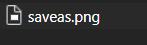
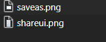

最近在学习 UI Security. 在看某个网站的时候，发现 devtool 里面居然是在动态加载图片。



(点击折叠下拉框后)：



被折叠的内容出现了，其中包含 shareui.png，可以从 devtool 看到，shareui.png 在展开之后才开始加载的。

这其实是减少一种初始 loading 时间的方法，很多内容不必要初始就加载，好奇他是怎么做的。


最简单的路径还是直接看未展开之前元素：

```html

```

所以他应该是在合适的时刻，将 src 改成对应的 png.

展开一下，果然 src 变了:

```html

```

那就该看看那一段 js 作用的，没想到合适快速的法子，从初始网页的 js 开始看起，没想到这么容易就找到：

```js
$( "#accordion" )
    .accordion({
        ...
        activate: function( event, ui ) {
            var qimg=ui.newPanel.find("img")[0];
            if(qimg!=null){
                qimg.src="imgs/"+qimg.alt+".png";
            }
        }
	})
```

作者也挺聪明的，直接用 alt 元素，省去了 map 存映射的麻烦。

打个断点，果然是这处。


作者通过后期给 img.src 赋值来延迟图片的加载，并将赋值的操作绑定在某些事件之后，让我们不必过分 “牵挂”，值得学习。