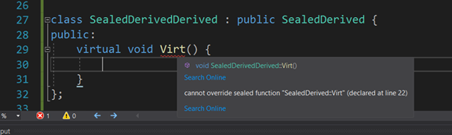
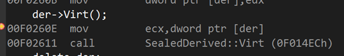

# Sealed 修饰符的使用

C++ 里面类的多态，譬如下方code：

```
Base* b = new Derived();
b->vFun();   // 将使用 Derived::vFun
```

的实现，依赖虚函数表。

虚函数表指针存在于 b 对象中，而指向的区域是 b 对象各种虚函数的指针，当我们要调用 vFun 时，我们从b 对象的虚函数表中，找到该函数对应的指针，并调用。

经常会是这样: (例程在 [src/sealed.cpp](src/sealed.cpp) )


其中 eax 存放虚函数表的地址，`call eax` 则是调用虚函数表的第一个函数 (`call dword ptr [eax+4]` 则是第二个函数)

确实很灵活，但是也不是 no-cost


由于 `call eax` 的存在(eax 指向虚函数表)，是否只要我们修改了 b 对象的虚函数表内容，让他指向到我们精心调制好的区域，这样当用户调用 `b->vFun()` 时, 我们精心调制好的 code 就会被执行？

正常时没法修改 b 对象的虚函数表的，但是 UAF（Use after free） 给了我们机会。当对象被 free 后，其空间被回收，此时新 allocate 的区域会指向这块被回收的区域，这样我们就可以随便往原来 b 对象的区域内写东西了。试想，如果我们的 code 有 bug，在 b 对象在被 free 之后，还被继续使用，我们还调用它的 virtual 方法，那会怎么样？

没错，它会读原来 b 对象的区域（也就是我们新 allocate 的区域）找到 vtable，执行 vtable 里面的方法。

如果在这之前，我们对新 allocate 的区域篡改，造了一个假的 vtable，让他指向我们区域 A，则在上述情况下，程序会运行到我们区域 A 的代码 ！

太危险了，UAF 是非常常见的程序漏洞，对此 我们要避免裸指针，拥抱智能指针，减少 UAF ！


sealed 则是另外一种解决 UAF 的思路。

我虽然重载了 base 的方法，这个重载的方法我不希望子类再重载，对于我的子类，不管怎么变，最终还是调用我这个重载后的方法，在这个情况下，这个被重载后的方法，我还需要加入到虚函数表吗？

对于上述情况，sealed 声明即可。

其实 sealed 是让子类放弃多态。它修饰的虚函数，其子类无法重载，故最终只能调用父类的方法：



调用 sealed 方法：



可以看到并不是用虚函数表的方式，而是直接调用其方法。