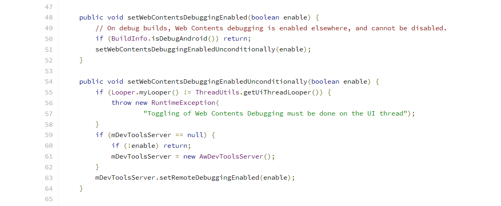
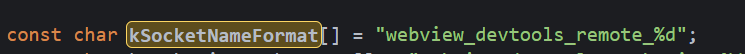
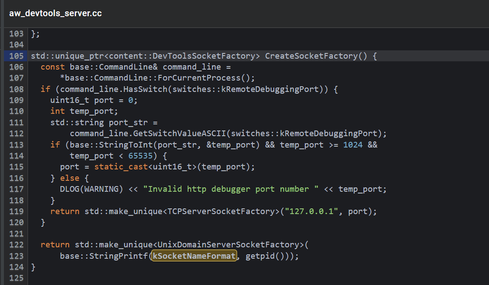

# chrome://inspect 内找不到 app 的 webview (2)

承接上文，inspect 里面没有 app 的 webview，是因为 webview 并没有注册 socket `**_devtools_remote` 

而我们此行的目的，是找到注册 socket 的开关，从而使得我们可以 debug  webview。

初步的方向是：

* Android 的 WebView 是否也是从 chromium 源码编译出来的（据说是，没考证）如果不是，是从哪个源码编译出来的呢？

* 找到对应的源码，寻找启动 devtools_remote 的代码


## Swim in the swarm of code

Chromium 里面启动 socket 的地方很容易找到，只要搜索关键字 devtools_remote 即可：

[ JNI_DevToolsServer_InitRemoteDebugging](https://source.chromium.org/chromium/chromium/src/+/main:chrome/browser/android/devtools_server.cc;bpv=1;bpt=1;l=169?q=devtools_remote&ss=chromium&start=1&gsn=JNI_DevToolsServer_InitRemoteDebugging&gs=kythe%3A%2F%2Fchromium.googlesource.com%2Fchromium%2Fsrc%3Flang%3Dc%2B%2B%3Fpath%3Dsrc%2Fout%2Fandroid-Debug%2Fgen%2Fchrome%2Fandroid%2Fchrome_jni_headers%2FDevToolsServer_jni.h%23gBzCtZQMMkIbJdqmYczTR4D0wq7YLUD_cv8V_qOwdSQ&gs=kythe%3A%2F%2Fchromium.googlesource.com%2Fchromium%2Fsrc%3Flang%3Dc%2B%2B%3Fpath%3Dsrc%2Fchrome%2Fbrowser%2Fandroid%2Fdevtools_server.cc%238pisG9f1vqvl5Whht5ItmtLb7EVWLy4sgJo-fHp638E)

它是由 Android 调用 DevToolsServer::InitRemoteDebugging, 接着在 jni 注册 socket。

而 Android 的呢？

Repo 是这个 [BUILD.gn - Code Search (android.com)](https://cs.android.com/android/platform/superproject/+/master:external/libchrome/BUILD.gn)

搜了一下，没有 DevToolsServer 的 code。凌乱了。

在网上搜索的过程发现了 MSDN  [Get started with remote debugging Android WebViews - Microsoft Edge Development | Microsoft Docs](https://docs.microsoft.com/en-us/microsoft-edge/devtools-guide-chromium/remote-debugging/webviews)

里面提到一个方法：

```java
WebView.setWebContentsDebuggingEnabled(true);
```

试了一下 果然可行，MSDN yyds.

尴尬了，前面的工作白费了吗？

没事，是要验证上面的方法，本质上也是开启 socket devtools_remote 即可

## setWebContentsDebuggingEnabled

很容易找到这个的实现：

```java
public static void setWebContentsDebuggingEnabled(boolean enabled) {
	getFactory().getStatics().setWebContentsDebuggingEnabled(enabled);
}
```

耐心地查看这些 getFactory() getStatics() 地接口，很容易找到目标：[WebViewChromiumFactoryProvider.java - chromium/src/android_webview/glue - Git at Google (googlesource.com)](https://chromium.googlesource.com/chromium/src/android_webview/glue/+/refs/heads/main/java/src/com/android/webview/chromium/WebViewChromiumFactoryProvider.java) 的成员变量 `WebViewChromiumAwInit mAwInit`，最终锁定在 SharedStatics 的这俩个方法：

[java/src/com/android/webview/chromium/SharedStatics.java - chromium/src/android_webview/glue - Git at Google (googlesource.com)](https://chromium.googlesource.com/chromium/src/android_webview/glue/+/refs/heads/main/java/src/com/android/webview/chromium/SharedStatics.java)



差点就被 Statics 这个名字蒙蔽了，是的，统计的类怎么会有逻辑代码呢？

溯源 AwDevToolsServer: 

[AwDevToolsServer.java - Chromium Code Search](https://source.chromium.org/chromium/chromium/src/+/main:android_webview/java/src/org/chromium/android_webview/AwDevToolsServer.java?q=org.chromium.android_webview.AwDevToolsServer&ss=chromium)

[android_webview/browser/aw_devtools_server.cc   JNI_AwDevToolsServer_SetRemoteDebuggingEnabled ](https://source.chromium.org/chromium/chromium/src/+/main:android_webview/browser/aw_devtools_server.cc;bpv=1;bpt=1;l=168?q=awdevtoolsserver&ss=chromium&gsn=JNI_AwDevToolsServer_SetRemoteDebuggingEnabled&gs=kythe%3A%2F%2Fchromium.googlesource.com%2Fchromium%2Fsrc%3Flang%3Dc%252B%252B%3Fpath%3Dsrc%2Fout%2Fandroid-Debug%2Fgen%2Fandroid_webview%2Fbrowser_jni_headers%2FAwDevToolsServer_jni.h%23nFCrJUOTI9lDm2JK4DNzuO3l4506ifzXrKCJ7B5RCb8&gs=kythe%3A%2F%2Fchromium.googlesource.com%2Fchromium%2Fsrc%3Flang%3Dc%252B%252B%3Fpath%3Dsrc%2Fandroid_webview%2Fbrowser%2Faw_devtools_server.cc%232VRxNYOPQTaVYvXP3ICQbOHi5N6WLuRWdh9E31jn_TQ)





就是这个了，它的 socket 名字叫 `webview_devtools_remote_$(getpid)`


原来如此，以上。

