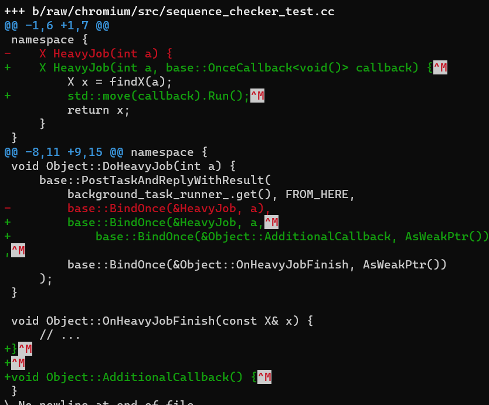

## Chromium SequenceChecker

最近遇到 sequence_checker 的问题，仔细一看，发现里面妙趣横生，所以想写篇文章，记录一下。

### 缘起

最近在改一处 code：

```c++
namespace {
    X HeavyJob(int a) {
        X x = findX(a);
        return x;
    }
}

void Object::DoHeavyJob(int a) {
    base::PostTaskAndReplyWithResult(
        background_task_runner_.get(), FROM_HERE,
        base::BindOnce(&HeavyJob, a),
        base::BindOnce(&Object::OnHeavyJobFinish, AsWeakPtr())
    );
}

void Object::OnHeavyJobFinish(const X& x) {
    // ...
}
```

正好 我需要加一个 callback，当 findX 结束后，调用我的 callback (至于为什么不直接在 OnHeavyJobFinish 加，我起初是不希望修改这个方法的)



但是很快出问题了，报的是：`Check failed: checker.CalledOnValidSequence(&bound_at). '`

搜了一下，是跟一个 sequence_checker.cc 有关系。


## 小径通幽

看了一下 sequence_checker.h 的定义，原来只在 Debug 开启的检查

```c++
#if DEBUG
#define SequenceChecker SequenceCheckerImpl
#else
#define SequenceChecker SequenceCheckerDoNothing
#endif
```

看了一下 sequence_checker_impl.cc 的实现，发现:

* SequenceChecker 会在初始化的时候，存储当前 thread 信息
* 提供 `CalledOnValidSequence` 方法，检查此时 thread 是否与之前保存的一致
* 可以通过 `DetachFromSequence` , 重置为此时的 thread 信息.

所以，SequenceChecker 通过记住初始化时候的 thread 信息，之后调用方可以随时检查是否与之前保存的不一致。

看了一下例子程序，以 [ruleset_dealer.cc - Chromium Code Search](https://source.chromium.org/chromium/chromium/src/+/main:components/subresource_filter/content/common/ruleset_dealer.cc;bpv=1;bpt=1) 为例，他就是在构造函数中保存 thread 信息，然后在每个方法都做了 thread 检查。检查每个方法调用都要加，确实有点麻烦。

看了一下我处理的类，似乎没有看到 sequence_checker 的踪影，这又是为什么呢？


### 复行数十步，豁然开朗

看了一眼 call stack，发现稍微往上的 stack 位于 [weak_ptr.cc](https://source.chromium.org/chromium/chromium/src/+/main:base/memory/weak_ptr.cc), 所以就随便看了一下，居然发现原来还有这种神奇的操作：

在 weak_ptr 里面，保存了一个 sequence_checker_, 它在 weak_ptr 初始化时候构建，所以会记录 weak_ptr 初始化时的 thread 信息。

在 T* weak_ptr::get() 的方法里面检查 thread 信息。

这就有意思了，比如`bindOnce(&Foo::func, AsWeakPtr())` , 在压入 bind 结构体之前，AsWeakPtr() 执行完毕，此时 weak_ptr 保存了执行 bindOnce 所在的 thread

当 Foo::func 被执行的时候，也就是 `((WeakPtr<Foo>)x)->func()`，会先调用 `WeakPtr<Foo>::get()` 方法，而 get 方法的第一句话，就是检查 thread。所以能确保 func 调用的 thread 跟执行 bindOnce 的 thread 一致。而这里面的代价，只是 AsWeakPtr().

妙，真妙。

没想到，做到 sequence checker 这么简单，你压根就不需要在方法里面加 sequence check 的代码，只需 WeakPtr 即可。

（后面查了一下 unique_ptr, shared_ptr, 由于直接用的第三方 libc++，所以没有添加 sequence_check 的代码, 比较意外的是跟 WeakPtr 同一目录的 scoped_ptr 也没有加入 sequence_check, 估计是 “sequence_check 比较费时” 以及 “在 BindCallback 里面，没有 WeakPtr 那么得常见”）

这有什么用呢？ 我们经常会有 UI thread 执行着需要扔一些 heavy job 到 IO thread，结束后继续在 UI thread 上面执行。

有了这个 checker，尤其是 AsWeakPtr, 我们就不用担心跑的线程乱了套。


欸，`PostTaskAndReplyWithResult` 里面第一个 callback 使用 AsWeakPtr 有事，而另外一个使用 `AsWeakPtr` 似乎没事。

这又是为什么呢？


### 极目张望

```c++
base::PostTaskAndReplyWithResult(
    background_task_runner_.get(), FROM_HERE,
    base::BindOnce(&HeavyJob, a),
    base::BindOnce(&Object::OnHeavyJobFinish, AsWeakPtr())
);
```

如上，`OnHeavyJobFinish` 使用了 `AsWeakPtr`, 也就意味着 如果 PostTask 时候是 UI thread, `OnHeavyJobFinish` 调用的时候，也必须是 UI Thread。他是怎么确保的呢？

```c++
bool PostTaskAndReplyWithResult(const Location& from_here,
                                const TaskTraits& traits,
                                TaskCallbackType<TaskReturnType()> task,
                                ReplyCallbackType<void(ReplyArgType)> reply);
```

PostTask* 这个方法可以确保 `task` 运行在 `from_here`, 也就是 `HeavyJob` 会运行在 `background_task_runner_`。

而 `reply` 则不会。PostTaskAndReplyWithResult 他会保存此时的 TaskRunner，并在后续 `task` 结束的时候，将 `reply` 扔到之前保存的 TaskRunner 中运行. 

这样就确保了 `OnHeavyJobFinish` 调用时的 thread 跟 `PostTask*` 的一致，满足了 WeakPtr 的要求。

附上 reply sequence 的保存以及使用：

```c++
// 保存
reply_task_runner_ = SequencedTaskRunnerHandle::Get();
// 使用
SequencedTaskRunner* reply_task_runner_raw = relay.reply_task_runner_.get();

const Location from_here = relay.from_here_;
reply_task_runner_raw->PostTask(
    from_here,
    BindOnce(&PostTaskAndReplyRelay::RunReply, std::move(relay)));
```


### 结语

* sequence_checker 用于检查 sequence 是否符合预期，确保方法调用所在线程符合预期。

* 往类里面加入 sequence_checker 比较 heavy，因为你需要每个方法都加，如果只用于 callback, `AsWeakPtr()` 能帮到你

* 这里面用 "thread 信息" 其实是比较含糊的，为了方便理解，所以才这么写，“准确”来说应该是："thread 的 sequence 信息"，但是这样又太绕口了。