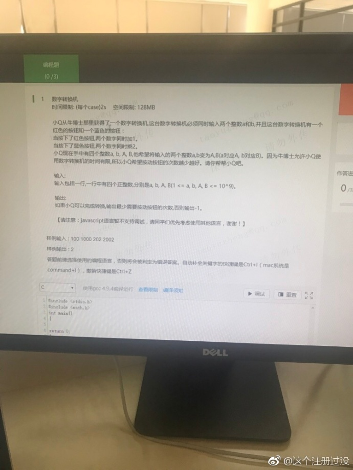

## Test01

这道题是在网上看到的，觉得有意思就写了一下。

首先，这种「联动」的，如果真的联动地去考虑 那真的中了作者的圈套了，应该试着消除这玩意。观察了一阵，嘿，我用数学的语言描述一下：假定操作了3次
```
op3(op2(op1(a))) = A
op3(op2(op1(b))) = B

op3(op2(op1(a))) + op3(op2(op1(b))) = A + B

又由于 加法 以及 乘法 符合结合律，即
op3(op2(op1(a)) + op2(op1(b))) = A + B
即 op3(op2(op1(a + b))) = A + B
```
恩，参数减少了一个，现在考虑的是 在这种情况下，对于一个数 x 通过这俩种变换怎么变成 X. 首先考虑到的是

\begin{equation}

n = log_2(X/x)

\end{equation}

n 大概可以有个操作的下限，但是上限呢，貌似是无底洞。
如果 将

\begin{equation}

X - x * 2^n

\end{equation}

多出来的值 怎么做呢？
其实余下的值，可以用 2 的阶数来表示，即：

\begin{equation}

a_02^0 + a_12^1 + a_22^2 + ... + a_n2^n

\end{equation}

那么应该可以得出一个等式：

\begin{equation}

X = (((x + a_n) * 2 + a_{n-1}) * 2 + ....) * 2 + a_0

\end{equation}
如果把 a 当做 1，那真的是赤果果的 某个著名的小学的等式啊。（记不起来了 囧） 
也就是他的最终解应该是

\begin{equation}

n + (X - x * 2^n 二进制时 1 的个数)

\end{equation}

粗略的写一下代码，没测过 可能有错：
```
#include "stdio.h"

int
main()
{
  int a, b, A, B;
  int x = a + b;
  int X = A + B;
  if (x > X) printf("imposible");
  
  int divider = X / x;
  int dividerLevel = 0;
  while (divider > 0)
  {
    dividerLevel ++;
    dividerLevel >>= 1;
  }
  
  int left = X - x * (2 << (dividerLevel - 1));
  int leftCounts = 0;
  while (left > 0)
  {
    leftCount += left & 1;
    left >>= 1;
  }
  printf("operations count: %d\n", dividerLevel + leftCount);

  return 0;
}
```

嗯嗯， 复杂度 logn

首先这个能得到一个正确解，是的，但是不是最优呢？
假定某 n 个操作可以修改成某 n-k 个操作，那减少的肯定是 + 法，替换上去的肯定是 &#42; 法。但，由于 &#42;2 替代 +1，就意味着连续有 L 个 +1 (L 大于等于当前的值)，但是 等式

\begin{equation}

X = (((x + a_n) * 2 + a_{n-1}) * 2 + ....) * 2 + a_0

\end{equation}

是不可能出现连续 +1 的操作的，必定有 &#42;2 作为断位，只可能有连续的 &#42;2 不可能有连续的 +1，所以得证？


